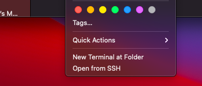

# MacOS Open from SSH
Quick Action to open a folder from a remote volume in the terminal via SSH

# Use Case
Let's say you're looking at a network folder and want to SSH into your server and run some commands.

### The Old Way
You'd have to open a terminal, `ssh` into your server and and `cd` to your directory on the server.

### With this tool
Just right click on the folder and press "Open from SSH".

The tool automatically gets the path, logs into your server and `cd`'s into the directory.

# Installation
 - Download the latest release from the [releases](https://github.com/menahishayan/MacOS-Open-from-SSH/releases) page.
 - Right-click > Open with > Automator (not Automator Installer)
 - In the code snippet, change constants in the first 4 lines as:
   - `username`: SSH username used on your server
   - `hostname`: hostname or IP address of your server
   - `publicPath`: SMB servers usually have a common **public** share. Specify the server-side path of the public share.
   - `userPath`: Server-side path where your **user** shares are located. This is usually your `/home/` folder. 
 - Save and close.
 - Double-click the file and macOS should prompt you to install it.

**Note:** Your mac and server should be [configured for passwordless SSH](https://www.tecmint.com/ssh-passwordless-login-using-ssh-keygen-in-5-easy-steps/) for this to work.

## Troubleshooting/Error Reporting/Contributing
 - If you face an error you may open a new issue on this repo prefixed by [Bug]
 - If you would like to help improve the project, request features or add functionality, open an issue prefixed by [Feature Request] or [Improvement]

## PRs and Commit Template
PRs and commits that you make to this repo must include the following:  
- Type: bug-fix or enhancement
- Description: Brief description about what the commit achieves
- Notes: (heads ups/pointers to other developers if necessary)

# Changelog
## v2.0
 - Rewritten in JavaScript (JXA)
 - Added import constants
## v1.0
 - Initial commit
